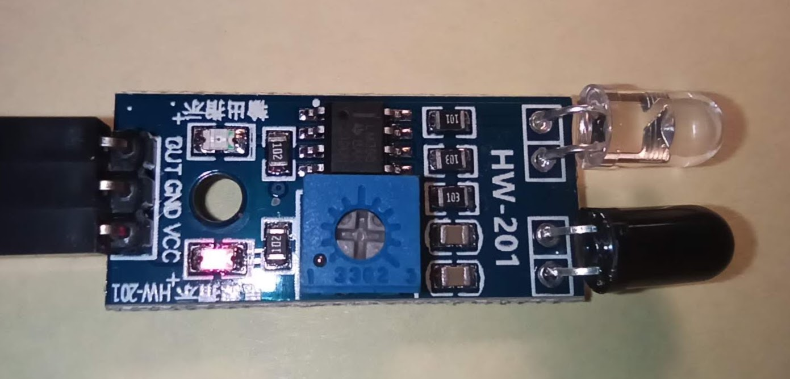
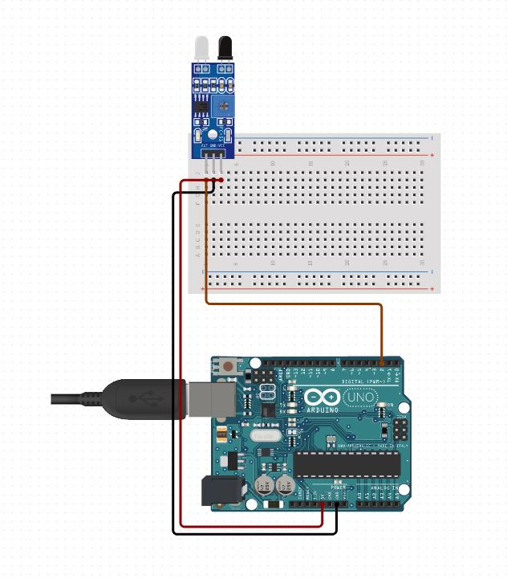

# Arduino Projects (under the MIT [license](LICENSE))

## Autonomus Car

My first Arduino [project](autonomous-car). The goal is to develop a car that can avoid obstacles on its own - using IR [HW-201](docs/arduino-ir-infrared-obstacle-avoidance-sensor-module.pdf) sensors.

[First connection](https://www.circuito.io/app?components=512,11021,811437)

## Knowledge

- [Language Reference](https://www.arduino.cc/reference/en/)
