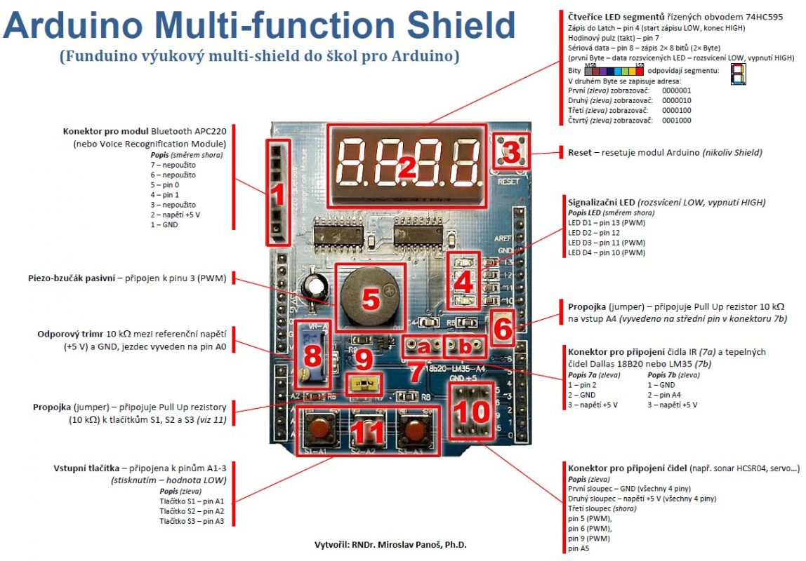

# Arduino Projects (under the MIT [license](LICENSE))

## Autonomus Car

My first Arduino [project](autonomous-car). The goal is to develop a car that can avoid obstacles on its own - using IR [HW-201](docs/arduino-ir-infrared-obstacle-avoidance-sensor-module.pdf) sensors.

[First connection](https://www.circuito.io/app?components=512,11021,811437)

## Knowledge

- [Language Reference](https://www.arduino.cc/reference/en/)

- [Multi-function Shield Expansion Board](docs/hackatronics-arduino-multi-function-shield.pdf)

| Multi Function Shield                                | Pins                     |
| ---------------------------------------------------- | ------------------------ |
| Buzzer                                               | Pin 3                    |
| 4-digit 7-segment LED tube driven by 74HC595         | Latch 4, Clock 7, Data 8 |
| A Reset Button and three programmable buttons        | A1, A2, A3               |
| Header for APC220 shield                             | GND, +5v, 0, 1 (rx/tx)   |
| Potentiometer (10 kOhm)                              | A0                       |
| Female header for temperature sensor LM35 or DS18B20 | A4                       |
| Socket for infrared receiver                         | 2                        |
| Free pins (pwm)                                      | 5, 6, 9, A5              |
| 4LED lights on the shield                            | 10, 11, 12, 13           |
